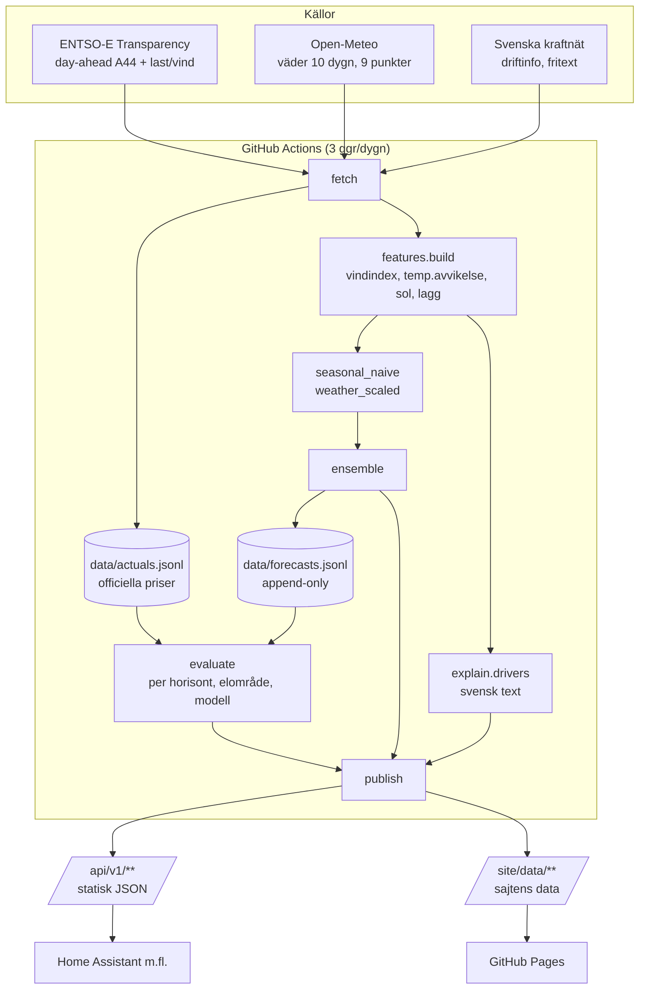

# Power Price Oracle

Elprisprognos för Sveriges fyra elområden — SE1, SE2, SE3 och SE4 — med öppet JSON-API
och uppmätt träffsäkerhet per prognoshorisont.

Sajten heter **Spotprognos** utåt. Projektet räknar ut en veckoprognos för Nord Pools
day-ahead-priser, **sparar varje utfärdad prognos**, fyller i det officiella utfallet när
det publiceras och redovisar i efterhand hur väl varje modell träffade — sorterat efter
hur långt i förväg prognosen gjordes. Det sista är hela poängen: en prognos som ställs ut
efter att auktionen stängt är en avskrift av börsen, inte en gissning, och räknas bort.

**Live:** `https://<USER>.github.io/<REPO>/` · **API:** `https://<USER>.github.io/<REPO>/api/v1/`

> Prognosen är en modell, inte ett elavtal. Påslag, moms och nät saknas.

---

## Arkitektur



Ingen databas, ingen server. Tillståndet är JSONL-filer i `data/` som checkas in i repot,
och allt som publiceras är statiska filer som genereras vid varje körning.

---

## Kom igång

### 1. Skapa repot

```bash
git clone <ditt-repo> && cd <ditt-repo>
python3.12 -m venv .venv && source .venv/bin/activate
pip install -r requirements.txt
```

Byt ut platshållarna `USERNAME/REPO` i `src/config.py` (`REPO_URL`) mot ditt eget repo.

### 2. Skaffa en ENTSO-E-nyckel

1. Registrera ett konto på [transparency.entsoe.eu](https://transparency.entsoe.eu/).
2. Mejla `transparency@entsoe.eu` med ämnet *Restful API access* och din
   registrerade e-postadress i meddelandet. Du får svar inom några arbetsdagar.
3. När du fått åtkomst: logga in, gå till *My Account Settings* och generera din
   **security token**.

Utan nyckel körs allt ändå, men i **demoläge** med syntetiska priser — se längst ned.

### 3. Lägg in hemligheten

I GitHub: **Settings → Secrets and variables → Actions → New repository secret**

| Namn | Värde |
| --- | --- |
| `ENTSOE_TOKEN` | din security token |

Tokenen läses bara från miljövariabeln. Den ska aldrig checkas in.

### 4. Slå på Pages

**Settings → Pages → Build and deployment → Source: GitHub Actions.**

Workflowet laddar upp `site/` som Pages-artefakt och committar samtidigt uppdaterad
data till `main` (historiken måste ligga kvar i repot för att träffsäkerheten ska kunna
byggas upp över tid).

### 5. Kör första gången

**Settings → Actions → Update forecast → Run workflow.**

Första körningen hämtar 90 dygn historiska priser via `src.backfill` innan pipelinen
körs. Lokalt:

```bash
export ENTSOE_TOKEN=...
python -m src.backfill          # 90 dygn utfall, idempotent
python -m src.pipeline          # hämta, prognosticera, poängsätt, publicera
python -m unittest discover -s tests -t .
```

Titta på resultatet lokalt:

```bash
python -m http.server 8000 --directory site
# öppna http://localhost:8000
```

---

## Så fungerar körningen

| Steg | Vad som händer |
| --- | --- |
| 1 | Hämtar day-ahead-priser (senaste 3 dygnen + morgondagen), väder 10 dygn framåt, ENTSO-E:s prognoser för last och vind/sol, samt SVK:s driftinfo. Varje källa får degradera för sig. |
| 2 | Uppdaterar `data/actuals.jsonl` idempotent, unik nyckel `(zone, ts)`. |
| 3 | Bygger feature-ramen: kalender, vindindex, temperaturavvikelse, solindex, prislagg 24/48/168 h. |
| 4 | Kör varje basmodell, väger ihop dem till en ensemble, och **lägger till** raderna i `data/forecasts.jsonl` — inget skrivs om i efterhand. |
| 5 | Poängsätter de senaste 90 dygnen per elområde, modell och horisontspann. |
| 6 | Skriver svensk drivkraftstext per elområde. |
| 7 | Publicerar `api/v1/**`, `site/api/v1/**` och `site/data/**`. |

Schema: 04:30, 11:20 och 16:00 UTC. Den mellersta körningen ligger efter att
day-ahead-auktionen publicerats runt 12:45 svensk tid.

Om en källa fallerar publiceras körningen ändå, med `degraded: true` och felet i
`api/v1/status.json`.

---

## Lägga till en modell

En ny modell är **en fil och en rad**.

```python
# src/models/lightgbm_v1.py
from .base import ForecastPoint, order_quantiles, target_window

class LightGbmV1:
    id = "lightgbm_v1"
    name_sv = "Gradient boosting"
    description_sv = "Kvantilregression tränad på features.build."
    quantiles = True
    derived = False

    def predict(self, features, issued_at) -> list[ForecastPoint]:
        start, end = target_window(issued_at)
        ...
```

```python
# src/models/registry.py
BASE_MODELS = [
    SeasonalNaive(),
    WeatherScaled(),
    LightGbmV1(),      # <- enda ändringen
]
```

Pipelinen kör den, sparar dess prognoser, poängsätter den per horisont och lägger in
den i API:t, i modellsidan och i jämförelsegraferna automatiskt. Kraven är att
`predict` returnerar punkter för alla fyra elområden från början av innevarande dygn
till +168 h, med `p10 ≤ p50 ≤ p90` — använd `target_window()` och `order_quantiles()`.

En modell som bygger på andra modellers utdata sätter `derived = True`, hamnar i
`DERIVED_MODELS` och implementerar `combine()` i stället, som ensemblen gör.

---

## API

Bas: `https://<USER>.github.io/<REPO>/api/v1/`

| Sökväg | Innehåll |
| --- | --- |
| `status.json` | Körstatus per källa, `degraded`, nästa planerade körning |
| `models.json` | Installerade modeller med id, namn och beskrivning |
| `zones.json` | Alla fyra elområden med aktuellt pris |
| `accuracy.json` | Träffsäkerhet per elområde, modell och horisont |
| `zones/{SE1..SE4}/forecast.json` | Timserie från i går 00:00 till +7 dygn, alla modeller, drivkrafter |
| `zones/{SE1..SE4}/history.json` | 30 dygn utfall + prognosen vi gav 24, 48 … 168 h innan |
| `zones/{SE1..SE4}/accuracy.json` | Träffsäkerhet för ett elområde |

Priser i **EUR/MWh**. Öre/kWh = EUR/MWh ÷ 10. Tidsstämplar är ISO-8601 med offset i
`Europe/Stockholm` och avser leveranstimmens början. `resolution` är `PT60M` i v1;
fältet finns för att kvartsvärden ska kunna läggas till utan att bryta klienter.

`source` i serien: `official` = publicerat auktionspris, `forecast` = vår modell,
`demo` = syntetiska siffror (ingen nyckel satt).

### Home Assistant

```yaml
rest:
  - resource: https://<USER>.github.io/<REPO>/api/v1/zones/SE3/forecast.json
    scan_interval: 1800
    sensor:
      - name: Spotprognos SE3
        unique_id: spotprognos_se3
        value_template: "{{ value_json.generated_at }}"
        device_class: timestamp
        json_attributes:
          - series
          - drivers
          - default_model
          - unit
```

Aktuell timmes pris ur serien — officiellt när auktionen är klar, annars ensemblens p50:

```yaml
template:
  - sensor:
      - name: Spotpris SE3 nu
        unique_id: spotpris_se3_nu
        unit_of_measurement: "öre/kWh"
        state_class: measurement
        state: >
          
          
          
          
            unknown
          
            {{ (match.actual / 10) | round(1) }}
          
            {{ (match.models.ensemble.p50 / 10) | round(1) }}
          
```

GitHub Pages tillåter GET från webbläsare, och Home Assistant behöver inte CORS.

---

## Modeller i v1

| Modell | Vad den gör |
| --- | --- |
| `seasonal_naive` | Priset samma veckodag och timme sju dygn tidigare. Referensen alla andra mäts mot. |
| `weather_scaled` | Den naiva nivån skalad med vindindex, temperaturavvikelse och sol, med egna vikter per elområde. Använder ENTSO-E:s residuallast när den finns. |
| `ensemble` | 35 % naiv + 65 % väderskalad. Sajtens och API:ts standardmodell. |

Ingen tränad modell i v1 — en färsk klon ska ge en prognos direkt. Kroken för
gradient boosting är utmärkt med `# FUTURE:` i `src/models/weather_scaled.py`.
Utförlig beskrivning finns på sajtens metodsida.

---

## Demoläge utan nyckel

Saknas `ENTSOE_TOKEN` kör pipelinen ändå — den hämtar väder, kör modellerna och
publicerar hela sajten, men markerar körningen `degraded: true`. Om `data/actuals.jsonl`
är tom faller den tillbaka på syntetiska priser från `data/fixtures/actuals_demo.jsonl`
(genereras med `python -m src.fixtures`).

De siffrorna är **inte marknadsdata**. De taggas `source: "demo"` i API:t och sajten
visar bannern *"Ingen ENTSO-E-nyckel — visar inte officiella priser"*. Prognoserna är
meningslösa tills en riktig nyckel är satt. Syftet är bara att repot ska gå att bedöma
utan hemligheter.

---

## Projektstruktur

```
src/
  config.py            elområden, vikter, sökvägar
  timeutil.py          Europe/Stockholm, horisontspann, auktionsgränsen 12:45
  store.py             JSONL: upsert av utfall, append av prognoser, rotation
  fetch/               entsoe_prices, entsoe_fundamentals, open_meteo, svk_text
  features/build.py    en rad per (ts, zone)
  models/              base, registry, official, seasonal_naive, weather_scaled, ensemble
  evaluate/            score, horizon
  explain/drivers.py   svensk drivkraftstext, ingen LLM
  publish/             api.py (api/v1 + site/api/v1), site_data.py (site/data)
  pipeline.py          python -m src.pipeline
  backfill.py          python -m src.backfill
  fixtures.py          python -m src.fixtures
site/                  statisk sajt på svenska
data/                  actuals.jsonl, forecasts.jsonl — publicerat tillstånd, checkas in
tests/                 python -m unittest discover -s tests -t .
```

---

## Licens och attribution

MIT, se [LICENSE](LICENSE).

Data från:

- **[ENTSO-E Transparency Platform](https://transparency.entsoe.eu/)** — officiella
  day-ahead-priser samt prognoser för last och vind-/solproduktion.
- **[Open-Meteo](https://open-meteo.com/)** — väderprognos och närhistorik, CC BY 4.0.
- **[Svenska kraftnät](https://www.svk.se/)** — driftinformation, används enbart
  extraktivt i drivkraftstexten.

Projektet är inte kopplat till, godkänt av eller granskat av Nord Pool, ENTSO-E eller
Svenska kraftnät.

## Ansvarsfriskrivning

Siffrorna är spotpris exklusive påslag, elcertifikat, energiskatt, nätavgift och moms.
Prognosen är en statistisk modell som bygger på en väderprognos — den missar
nivåskiften den inte kan se, som kärnkraftsstopp eller kabelfel. Fatta inga ekonomiska
beslut på den utan att kontrollera mot din elhandlare.
